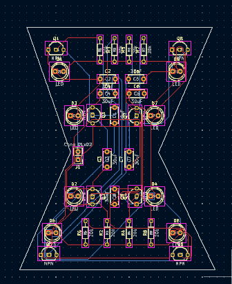

## 22.3.2026 
### Time spent : 2H
First i did some research for what you can make with the parts we could use, and i got a few ideas. I thought about using an astable vibrator to create an "animation". I 
Than started creating it in falstad. It did work which was unusual for me since i always have to reiterate. When that was done i just redidid the schematic in KiCad, which was relatively easy. Then came the part of thinking about the edge.cut shape. I wanted a butterfly at first since that could look like its flapping its wings but i aint that good at drawing so i setteled on a much simpler shape, An hourglass (i finally remembered what its called but ill keep the names).  
Since i had a shape thought of i made a 100x100 mm rectangle drew the hourglass shape inside and i was done with the edge,cuts. Then i had to place the Leds and other components, and here came the hard part i just couldnt do it today.

## 24.3.2026
### Time spent : 1H

I had most of the stuff from the other day. I just had a lot of redoing since i had to always move something since it was in the way. When that was done i had to route
everything whilst not making it that much of spaghetti(but it did end up looking like spaghetti). Since its school week i didnt do much and was wrecked by this point.

## 25.3.2026
### Time spent : 0.5H

I just took pictures made renders and wrote the readme and journal.md