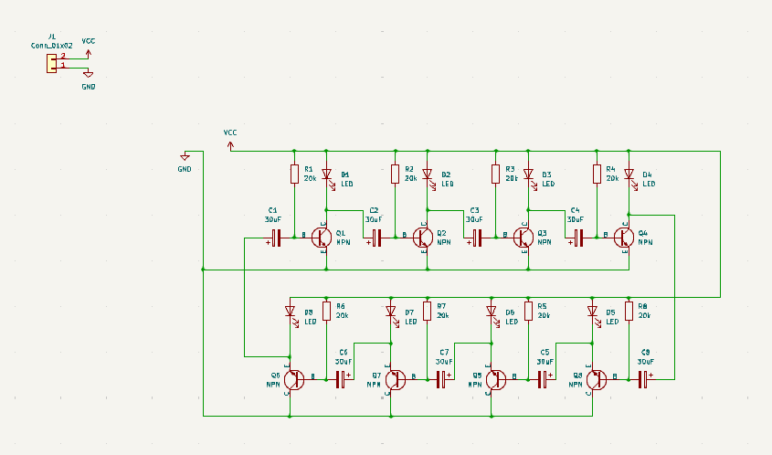

# An astable vibrator in the shape of a sand clock
I made this for resolution hardware week 2. It has 8 leds 4 on each half to mimick the real life clock.
  
---
### Simulation
#### how it works
The transistors are the switches, and before that switch can turn on the led the capacitor has to charge up, when it does it puts enough current to turn the led on and also begin charging the next cap to form a loop.

[link to the sim](https://is.gd/97cx6k)
### Schematic

